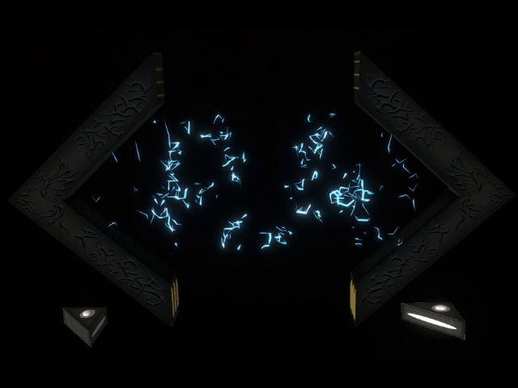
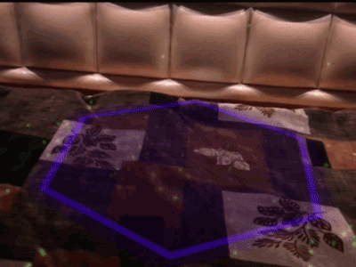

<a href="https://ar.ra101.dev" alt="https://ar.ra101.dev" ><h2> com.qlabs.ARCard.apk </h2> </a>

  

  <h3> A Personalized Visiting Card that floats in AR space. </h3>
  <h1></h1>
<h1 id="-----">
    

 </h1>

   

  

    

 

#### 📹 Video: [LRBY](https://odysee.com/@ra101/AR-Card)  |  [YouTube](https://youtu.be/gEvrnAHbdMw)

  https://user-images.githubusercontent.com/34714949/162001887-b91c96e1-ba50-4a10-8538-24c8806891e6.mp4

  <iframe id="odysee-iframe" style="width:74vw;height:42vw;" src="https://odysee.com/$/embed/AR-Card/691d6cae3a29ba19424115d65dc4d8abba8a6fff?r=45vpskZGbEGUURSfgbmqd6b53WGvvGuh" allow="accelerometer; autoplay; clipboard-write; encrypted-media; gyroscope; picture-in-picture" allowfullscreen></iframe>

 

## 💼About

An AR Portfolio App made in Unity3D. The Plan is show off my Unity/AR Skills in most glorious yet in an absolutely unnecessary way!

After Installation, App opens in the following steps:
 - Requires permission for Camera.

    

      
    

 - Green points appear on the detected horizontal plane.

    

      
    

 - Once enough area is covered, violet Hex shaped landmark appears, and you are asked to tap on screen, when location is seems good.

    

      
    

 - On tapping, A Machinery is summoned, you are asked to "Open the Brackets" (zoom out gesture).

    

          
    

    
<i>(There is a little Eater Egg, if you try to close bracket after opening) </i>

 - Once Opened, Now you are asked to "Accelerate the Machine" (Shake the Device), so it can generate momentum and Start like an engine does.

    

      
    

 - Machine generates a <a href="https://www.space.com/white-holes.html">WhiteHole</a> which expands and emittes Information and Energy for machine to work perpetually.

    

      
    

 - After the blast, The following things can be observed,
    - "RA" can be seen in middle of machine.
    
      

        
      

    
    - Monting points now contain information:
      - Left Mount displays Name or Alias, according to machine's wishes.
      
        

          
        

      
      - Right Mount display a **tappable** list of links, Each link will open in the associated apps.
      
        

          
        

 

The Current <a href="#-----">Release/Download</a>, only supports **Android 7.0 and above**.

 

## 🎁Donations

## 🤙Contact Me

 

 

 

  <h3> Made with <b>❤️</b> by<b>〈 RA 〉</b></h3>

